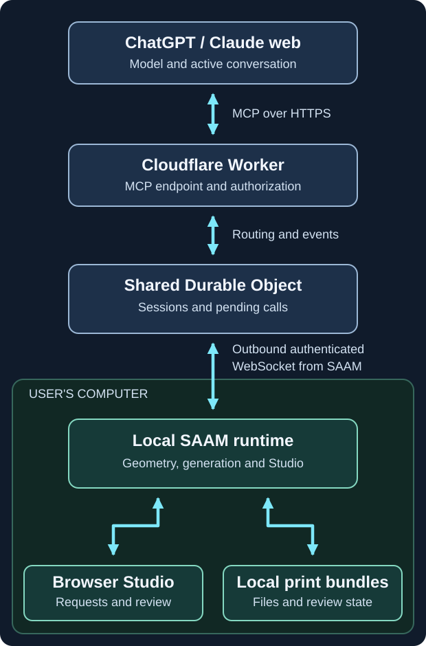

# Packaged SAAM with a Cloudflare MCP relay

Status: alpha milestone specification and implementation roadmap. This document
describes intended behavior, not shipped functionality. Beta distribution is
included for context, not as an alpha release gate. The current task is planning;
implementation and production deployment are subsequent work.
[D-037](../../DECISIONS.md#d-037--cloudflare-relay-and-studio-driven-chat-sessions)
records the user's direction and its scope.

## Goalpost

A person installs SAAM, connects their own ChatGPT or Claude web account, and
starts a SAAM session in chat. During that active session, requests made in
Studio reach the assistant without an additional message or click in chat.
The assistant performs the requested work, explains the result, and resumes
listening. Geometry, slicing, preview, print files and machine-program generation
run on the person's computer. The person reviews and confirms the current
settings and exact toolpath in the existing browser-based Studio before delivery.

The relay authenticates, routes and retains bounded coordination data. Model or manufacturing computations are run on the user's machine, not on the relay. Model usage belongs to the user's chat account; SAAM collects no model API key and makes no separately billed model API calls. The chat provider still runs the model and applies its own limits.

This milestone is built toward that interaction directly. There is no separate
capability-research project or feasibility gate before implementation. Normal
integration and release acceptance must demonstrate the required behavior;
protocol support alone is not evidence that a web product sustains a session.

**Deferred — beta, outside alpha scope:** Replace ChatGPT developer-mode setup
with a reviewed, published MCP-backed plugin; embedded chat UI is optional, so
Studio can stay local. Publication needs a verified publisher, production
endpoint/OAuth, listing and policy materials, reproducible review cases and
approval. It does not waive account/workspace/tool permissions or establish
timeout support. The future setup column below describes the intended user
experience, not an alpha requirement or confirmed listing availability. Detailed
publication work remains deferred; see
[OpenAI's submission process](https://developers.openai.com/plugins/deploy/submission).

## Selected scope and planning defaults

| Area | Requirement or default |
|---|---|
| Chat clients | ChatGPT web and Claude web, using the person's own eligible account and connector permissions. |
| ChatGPT distribution | Alpha uses a developer-mode custom connection. Future beta context: reviewed publication for normal directory installation, outside alpha acceptance. |
| Hosting | Cloudflare Worker and Durable Objects as a relay. |
| Installation | Downloadable OS-specific ZIP containing an installer and a complete local runtime. Windows and macOS carry forward [D-023](../../DECISIONS.md#d-023--future-deployment-local-saam-application-with-a-hosted-relay). |
| Interface | Retain Studio in a browser. The initial supported review flow is on the computer running SAAM. |
| Interaction | Pending MCP event waits deliver Studio requests to the active assistant; the assistant renews its listener after responding. |
| Quiet wait | Support a 7 minute 30 second quiet interval. Target one 450-second call in ChatGPT, or two 225-second calls with one automatic renewal in Claude. These are not session or computation caps; ChatGPT's deadline remains an implementation target to satisfy. |
| Pairing | One active paired installation per SAAM account. No installation picker in the normal workflow; replacing the paired computer is an explicit settings action. |
| Workload and hosting target | $5/month Cloudflare relay budget; alpha cap 150 active users at five prints/day and 30 ordinary MCP calls/print, plus the explicit listening/transport allowances below. The original 200-user case remains a cost comparison. |
| Relay partitioning | Proposed implementation default: one shared relay object for the initial deployment, with explicit installation and session routing. Per-user objects are not required. |
| Device lifecycle | Proposed default: a per-user local background process started by the launcher; closing a chat connection does not kill local computation. |

The shared-object choice, exact supported OS versions/CPU architectures, installer
technology, identity provider and update mechanism are engineering selections
within this plan, not separately recorded human decisions. Windows/macOS support
does not imply every historical OS release or CPU architecture. Select and publish
the supported matrix when producing release artifacts. Linux and remote Studio
review are outside this first milestone.

## Person's workflow

1. Download the ZIP for the supported platform and run its installer. No Git,
   terminal, Node installation, package installation or compiler is required.
2. Launch SAAM. Studio opens locally and guides the person through sign-in,
   pairing this installation and connecting the remote MCP endpoint in their
   chosen chat product. Account eligibility or workspace restrictions are shown
   as setup requirements rather than unexplained connection errors.
3. Start a SAAM session once in chat. It connects to the account's paired
   installation automatically. The assistant reads the relevant installed
   guidance and arms the Studio listener.
4. Describe the desired part for the agent to create, or load an STL in Studio.
   The agent drives part creation or preparation of the imported mesh, chooses
   the appropriate tools and settings, and publishes results for the person to
   review in Studio. The person guides revisions through conversation or Studio
   requests; the assistant acknowledges, claims and performs that work, explains
   the result, and returns to listening.
5. Request generation and inspect its progress locally. The assistant can observe
   completion, failure or cancellation through the same event mechanism.
6. Confirm the current settings and exact toolpath in Studio and obtain the
   reviewed machine program locally through the existing delivery boundary.
7. End the SAAM session explicitly. Saved prints remain available; reopening
   SAAM and starting a later chat session can select them again.

Tool-consent prompts imposed by the chat product are distinct from Studio's
manufacturing confirmation. Onboarding explains the permissions needed for an
ongoing session. The relay cannot override host permissions.

## Account eligibility and client boundaries

Alpha uses custom remote MCP connections. Eligibility does not override tool
permissions, provider quotas or conversation limits.

| Web account | Alpha setup requirements | (future) beta setup requirement |
|---|---|---|
| ChatGPT Free/Go | Not listed as eligible for developer mode; outside the documented alpha route. | Eligibility unconfirmed. Do not assume publication alone enables SAAM on these plans; confirm the listing's plan/country availability before adding support. |
| ChatGPT Plus/Pro | Enable developer mode, add SAAM, authorize the account connection and select it for the conversation. | Install the reviewed SAAM listing and connect the account, without developer mode, where the listing is available. |
| ChatGPT Business/Enterprise/Edu | Developer-mode connection as above, subject to workspace roles, connector availability and action policies. | Workspace permits the published SAAM integration and required tools; members install/connect under those policies. No end-user developer-mode setup. |
| Claude Free | Add and authorize the custom connector; SAAM occupies the one available custom-connector slot. | Retain that connector route and limit; a directory connector could simplify setup if separately published. A bundled Claude plugin would require a paid plan. |
| Claude Pro/Max | Add and authorize SAAM's custom connector, then enable it in the conversation. | Same connector setup, or connect through a directory listing if separately published; developer mode is not required. |
| Claude Team/Enterprise | An Owner/Primary Owner adds the connector; members authorize their own SAAM accounts under organization tool policies. | Owner enables the custom or separately published connector; members connect under the same policies. Publication does not bypass organization controls. |

Sources: [ChatGPT developer mode](https://developers.openai.com/api/docs/guides/developer-mode),
[published ChatGPT plugins](https://learn.chatgpt.com/docs/plugins),
[OpenAI workspace controls](https://learn.chatgpt.com/docs/enterprise/apps-and-connectors),
[Claude custom connectors](https://support.claude.com/en/articles/11175166-get-started-with-custom-connectors-using-remote-mcp),
[Claude directory/workspace setup](https://support.claude.com/en/articles/11176164-use-connectors-to-extend-claude-s-capabilities)
and [Claude plugin eligibility](https://support.claude.com/en/articles/13837440-use-plugins-in-claude).

The future column retains per-user SAAM authorization; organization-wide shared
credentials are not part of this plan. A Claude directory connector and a bundled
Claude plugin are different distribution options, neither assumed published.

Work, Codex, Claude Code, desktop, Cowork and mobile support are outside alpha
acceptance; preserve the existing local adapter. API billing is a separate route.

The public relay must be reachable by provider infrastructure, and the local
installation needs outbound HTTPS/WebSocket access. Corporate installation and
network policies may require IT assistance.

## Permission screens and first-use experience

These are planned screens. SAAM owns installation, pairing and local review;
the provider owns connection and tool-consent dialogs. Labels and prompt counts
vary by client and policy.

| Screen or action | Permission granted |
|---|---|
| ZIP installer and possible OS open confirmation | Run SAAM as the local user and store application data/prints. Target signed per-user installation without administrator elevation; startup-at-login is a separate preference. |
| SAAM sign-in and confirmation of this computer | Pair the installation to the account and accept authenticated relay operations. |
| ChatGPT developer-mode setup or Claude custom connector setup | Make SAAM tools available to the chat product, subject to workspace policy. |
| Provider connection notice, then SAAM OAuth authorization | Read print/job information, create/revise prints and start/cancel preparation jobs. Explain that request text, parameters and compact results cross the relay and provider. Reuse an existing SAAM login where possible. |
| Provider tool-consent prompt | Allow the assistant to invoke a particular operation, such as creating a print. Account connection does not automatically allow every tool. |
| Studio file picker | Import the selected STL. |
| Studio settings/toolpath confirmation | Approve that specific current output for local delivery. |
| Later session or disconnect controls | Reuse pairing/account access unless revoked or expired; tool choices may recur. Keep end-session, disconnect-provider and unpair-device controls distinct. |

OAuth capability groups above are proposed, not finalized scope names. SAAM uses
tokens for its own service, not the person's chat password or model API key.
The local program has ordinary OS-user privileges; bounded connector operations
are not a claim of OS sandboxing. Use application storage and explicit file
selection rather than broad filesystem permission requests. Screen recording,
accessibility, microphone access and a public-server firewall exception are not
part of the setup.

ChatGPT alpha can remember consent per tool for a conversation; new chats or
refreshes may prompt again. Claude's allow/ask/never choices are constrained by
organization policy. Several tools may need initial consent. If policy requires
per-call approval, the no-extra-chat-click experience is unavailable. Describe
tools accurately; never disguise writes as reads to suppress prompts.

Sources: [ChatGPT consent](https://developers.openai.com/api/docs/guides/developer-mode),
[OAuth](https://developers.openai.com/plugins/build/auth)
and [Claude permission controls](https://support.claude.com/en/articles/13930452-manage-custom-roles-on-enterprise-plans).

## Architecture and ownership

| Component | Owns |
|---|---|
| Chat host | Model inference, conversation lifetime, tool permissions and issuing subsequent calls. |
| Worker | Public MCP endpoint, authentication, authorization, protocol handling and routing. Tool discovery works while an installation is offline. |
| Durable Object | Device routing, session leases, bounded event/command records, compact status and pending waits. |
| Local runtime | Capability execution, job lifecycle, print persistence, workers, Studio service and reconnect reconciliation. |
| Studio | Geometry/process/toolpath presentation, user requests, file selection, human confirmation and local download. |

Local bundles own revisions, geometry, generation, approval and delivered bytes.
Cloud status includes source revision, sequence and observation time. Mutations
run through explicit local operations that check revisions; delayed status must
not roll a bundle back. Relay receipts establish coordination, not local success.

Resolve the authenticated account to its one active installation. Replacement
revokes the old device grant and ends its relay session; it does not migrate
files. Bind an opaque SAAM session handle to the account and installation, with
one active assistant session per installation. The handle routes calls and
retries; it is not authorization and needs no provider conversation ID.

Apply these boundaries:

- Use chat-compatible OAuth and a separate revocable device credential. Pair
  through an expiring, single-use flow. Keep credentials out of tool results,
  bundles, bearer-secret URLs and logs.
- Authorize account, installation, session and operation on every route. Fence
  old connections after reconnect, expiry or device replacement; enforce payload
  bounds and per-account abuse protection even in a shared object.
- Expose defined SAAM operations and Studio-selected file handles, not arbitrary
  shell execution or unrestricted paths. A chat attachment is not automatically
  a local file. Preserve Studio's loopback and browser-origin protections.
- Keep meshes, full toolpaths and delivered programs local by default. Relay
  only the request text, parameters, diagnostics and status needed by the
  assistant; define retention/deletion and avoid content logging by default.
- Preserve human settings/toolpath confirmation and exact-byte delivery checks.
  Account/tool consent cannot approve a print. Alpha delivers files, not hardware
  operation.

Reuse local MCP/CLI operation handlers; separate transport registration from
execution rather than moving Node/filesystem or geometry code into Cloudflare.
The shared object uses asynchronous session handlers without a global wait lock.
Accept device sockets through the hibernation API so periods with no pending
work can idle; partition later only if load, locality or failure isolation warrants it.

## Capacity and cost design

**Alpha target: $5/month for the Cloudflare relay, with a cap of 150 active
users at five prints per day.** Use one Workers Paid account and one shared
SQLite-backed Durable Object. This is a budget-derived admission cap, not a
Cloudflare seat limit or measured throughput result. The $5 covers relay hosting
before tax; domains, signing, download hosting and any paid identity service are
separate. Assume no unrelated workloads consume the account's allowances.

Each user produces 150 prints in a 30-day month. The 30 ordinary MCP calls per
print are the supplied workload; the remaining rows below are explicit planning
allowances to replace with measured usage. Budget one DO invocation per MCP
call and the more expensive Claude renewal pattern for every user.

| Request budget | Per user/month | At 150 users/month |
|---|---:|---:|
| Ordinary calls: 150 prints × 30 | 4,500 | 675,000 |
| Event-completed waits: 5 per print, batching UI/job events | 750 | 112,500 |
| Quiet listening: 7:30 per print, 2 waits | 300 | 45,000 |
| Device-to-relay messages: 40 per print, billed at 20:1 | 300 equivalent requests | 45,000 |
| Connection setup, discovery/auth routing and retries | 150 | 22,500 |
| **Total metered DO requests** | **6,000** | **900,000** |

Reserve 10% of the one-million request allowance:
`floor(1,000,000 × 0.90 / 6,000) = 150 users`.
Without that reserve, the arithmetic limit is 166 users. The reserve is unused
headroom, not an extra billed item. Longer listening or more event calls lowers
the cap: 30 quiet minutes per print instead of 7:30 gives about 130 users with
the same reserve. These allowances do not impose job or session time limits.

| Monthly hosting item | Included in the plan | Budget at 150 users | Projected monthly charge |
|---|---:|---:|---:|
| **Workers Paid base subscription** | Workers + DO access and allowances below | One account | **$5.00 base** |
| DO requests | 1,000,000 | 900,000 | $0 |
| DO duration | 400,000 GB-s | 331,776 GB-s, even if active for all 30 days | $0 |
| Worker requests / CPU | 10 million / 30 million ms | At most 900,000 / 4.5 million ms | $0 |
| SQLite writes / reads | 50 million / 25 billion rows | At most 9 million / 90 million rows | $0 |
| SQLite retained storage | 5 GB-month | At most 0.75 GB-month | $0 |
| Workers Logs | 20 million events | At most 3 million events | $0 |
| **Projected alpha total** | | **150 users; about 3.3 cents/user/month** | **$5.00/month** |

The non-request budgets are implementation targets: average Worker CPU at most
5 ms/request; at most 10 billed row writes and 100 reads per metered DO request,
including indexes, cleanup and device-message handling; at most 5 MB retained
per user and 20,000 log events per user/month. Keep records compact, prune under
the retention policy and sample diagnostics. All account-level housekeeping
must fit these budgets too. Validate them during implementation; request counts
alone do not establish the final bill. Batch progress and use protocol-level
WebSocket heartbeats to avoid unbudgeted application-message traffic while idle.

**Above the alpha cap:** each additional scenario user adds 6,000 requests/month.
Once the included allowance is exhausted, the request-only marginal rate is
`6,000 × $0.15 / 1,000,000 = $0.0009/user/month` (0.09 cents).
The invoice rounds excess DO requests up to whole million-request blocks:
`$5 + $0.15 × ceil(max(0, 6,000N − 1,000,000) / 1,000,000)`.
Thus 151-166 users still project to $5; 167-333 to $5.15; and 334-500 to $5.30.
The original 200-user scenario projects to **$5.15/month**, not $5.

That projection through 500 users assumes the same one-object design and the
other per-user budgets above, which remain inside their included allowances.
It is a cost illustration, not an increase to alpha admission or a load-test
claim. Duration is shared across simultaneous waits in one object; adding users
does not multiply it. Additional objects, heavier SQL/logging or extra services
require a revised model. An open wait still uses some of the person's model
allowance when the assistant processes results and renews.

Sources: [Workers subscription, CPU and logs](https://developers.cloudflare.com/workers/platform/pricing/)
and [DO requests, duration, SQLite and billing rounding](https://developers.cloudflare.com/durable-objects/platform/pricing/).

## Session protocol and recovery

Adapt `wait_for_studio_request` into a cursor-based wait carrying Studio requests
and relevant job events. A pending tool invocation lets its result reach the
model; an open socket alone does not establish that the assistant is listening.

### Normal sequence and timing

1. Start the SAAM session and wait from the last acknowledged event cursor.
   Return retained events immediately; otherwise keep the call pending.
2. Journal Studio actions locally and durably accept them at the relay before
   acknowledging delivery. Complete the wait with a structured event result.
3. The assistant claims actionable requests with `begin_studio_work`, executes
   revision-bound operations, publishes results and resolves the request.
   Observations such as progress do not authorize edits.
4. Explain results visibly and call the listener again. A quiet expiry returns
   `idle` and a renewal instruction; renew without a user message. Events arriving
   between calls stay queued. Renewal neither cancels work nor ends the session.

| Client | Per-call target | Quiet 7:30 interval |
|---|---|---|
| ChatGPT | 450 seconds | One call. The cited provider documentation does not establish this deadline; report any implementation limitation explicitly. |
| Claude | 225 seconds | Two calls with one automatic renewal, leaving 15 seconds below its documented 240-second deadline per call. |

The interval excludes brief host renewal processing and is not a session or
computation cap. Continue renewing while active. Expensive local work returns a
job receipt and completes independently; its result can arrive in a later wait.
Any shorter-call fallback must be disclosed rather than counted as meeting the
requested per-call target.

### Delivery and visible state

Events carry ID/sequence, session, installation, Studio instance, print/revision
where applicable, kind, request/job ID and source timestamp. Return bounded
batches with cursors. Use at-least-once delivery, deduplication and explicit
acknowledgment; reading cannot destructively consume a result before retry.
Identify handled events so the assistant can avoid repeating completion messages.

Retain actionable requests until resolved or visibly expired; coalesce transient
progress. If a cursor predates retained history, return a resynchronization
result and current snapshot. Old observations must not become new instructions.

Show disconnected, connecting, listening, working, reconnecting and ended states,
or clear equivalents. A pending wait establishes listening; an active claim
establishes work. A bounded lease covers normal gaps between calls. On expiry,
show that the assistant needs attention and retain requests. Device connectivity
and assistant availability remain separate.

### Interruptions

| Interruption | Required behavior |
|---|---|
| User stops the assistant, or host ends the turn/limits usage | Stop dispatch when cancellation is observable; otherwise expire the lease. The session ends: its unfinished requests fail visibly and Studio stays open. No automatic assistant restart or session resumption. Accepted local jobs continue unless explicitly cancelled. |
| HTTP/network loss or relay restart/deploy | Preserve acknowledged requests/outcomes. Retry within the active lease safely, without repeating edits. If the host does not retry, expire the lease and show that chat needs attention. |
| Local sleep or network loss | Mark offline, stop dispatch and retain committed requests/job identity. Reconcile on return; do not claim progress during sleep. |
| Local process crash | Recover committed artifacts and receipts; report unfinished computation interrupted unless recovery is supported. |
| Duplicate command/event | Reuse the recorded outcome; reject an idempotency key reused with different arguments. |
| Concurrent edit or stale revision | Reject or supersede explicitly; never apply results to a different revision. |
| New chat on an unfinished print | After the old session ends/expires, start a fresh session from the saved bundle and outstanding jobs. Nothing of the old session is resumed. |
| Explicit end, unpair or revocation | Reject new commands under that grant. Listener loss alone does not approve, deliver or cancel a job. |

Normal idle renewal is not an interruption. Lost HTTP responses still require
deduplication because local execution may already have succeeded. A host-ended
conversation may require the person to resume chat; automatic wake-up of ended
chats is outside the goalpost.

## Local execution and packaging

Give the local runtime an explicit lifecycle independent of individual MCP HTTP
connections and Studio browser tabs. Reuse existing generation workers, progress,
cancellation and shared print lifecycle. Keep status/cancel/event handling
responsive while computation runs; do not hold the adapter's ordinary operation
queue across a listener wait. Serialize conflicting print mutations, not every
user or every installation behind a single global job queue.

Each submitted operation records its idempotency key, input identity, print
revision, state and terminal outcome. Distinguish accepted by relay, accepted
locally, running, succeeded, failed, cancelled and interrupted. A relay receipt
does not establish successful local execution. Cancellation acknowledges an
actual cancellation outcome; a commit already in progress must be handled by
the shared generation owner. Reuse BR-050's ownership/recovery work where it
overlaps instead of creating a second cancellation or claim mechanism.

Package the pinned runtime, production dependencies, kernels/assets, shared
guidance, supported skills and machine definitions with the application. Exclude
developer credentials, private local extensions, test prints and Git metadata.
Choose whether optional native repair is shipped per platform; include applicable
licenses and a supported prebuilt binary when it is offered. Never discover a
missing compiler during ordinary first use.

The installer sets up a per-user application, launch entry and separate persistent
data directory, runs a lightweight first-use health check and opens Studio.
Installation, update, rollback and uninstall must preserve prints by default.
Use signed/notarized release artifacts as applicable to the supported platform,
an authenticated release manifest, integrity checks and a recoverable install
transaction. Install updates at an idle boundary; do not replace a running
generation's code underneath it. Provide explicit protocol/version compatibility
errors rather than leaving an old installation apparently connected but unusable.

## Alpha implementation roadmap

Refresh implementation boundaries when work begins; concurrent development may
change the linked sources. Acceptance identifiers refer to the checklist below.

| Stage | Deliverable and existing owners | Acceptance |
|---|---|---|
| 1. Local execution boundary | Separate reusable [MCP operations](src/runtime.mjs) from [stdio registration](src/server.mjs); establish runtime ownership and recoverable jobs using [generation workers](../../studio/prepared-generation-job.mjs) and [BR-050](../../build_request.md#br-050--finish-studio-coordination-and-read-path-handoff) claim/cancellation work. BR-050's local database deferral does not prohibit relay storage. | A2, A3, A4 |
| 2. Authenticated relay | Worker/MCP endpoint, OAuth, one-device pairing, shared DO, outbound connection, retained records and bounded retries. | A1, A3, A5 |
| 3. Active session | Adapt [agent requests](../../studio/agent-requests.mjs), [events](../../studio/studio-events.mjs) and [Studio](../../studio/server.mjs) for cursor waits, renewal, visibility and recovery. | A2, A3 |
| 4. Maker workflow | Agent-led creation or STL preparation, editing, generation/progress/cancel, local review and exact-byte delivery. | A2, A4 |
| 5. Installable releases | Windows/macOS installers, bundled runtime, pairing, diagnostics and safe updates. Update [setup](../../SETUP.md) and [MCP guidance](DEVELOP.md). Can proceed alongside stages 2-4 after stage 1's runtime layout stabilizes. | A1 |
| 6. Alpha release | Complete load/recovery coverage, cost projection and support instructions. Public-directory approval is not required. | All |

## Alpha acceptance

- **A1 — Setup:** Clean supported Windows/macOS machines install, pair and connect
  each target web client without development tools or SAAM-supplied inference.
  Document developer mode, eligibility, consent persistence and supported builds.
  Update/rollback preserves prints.
- **A2 — Interaction:** Each client handles repeated Studio requests without
  intervening chat input after permission setup, reaches the model and resumes
  listening. Cover the specified 7:30 timing, idle renewal, and computation longer
  than one wait while status/cancel remains responsive. Proposed scenario: at
  least 30 minutes, not a session cap. Report any client constraint.
- **A3 — Isolation/recovery:** Exercise the interruption table. Retries cannot
  duplicate edits, stale sessions/revisions cannot affect the wrong print, and
  device replacement revokes the old grant. Studio reports availability honestly.
- **A4 — Output:** Agent creation and STL preparation both reach local review and
  delivery, with human confirmation bound to the current output and matching
  delivered bytes. Software evidence does not establish physical print results.
- **A5 — Capacity/cost:** With 150 simultaneous sessions, preserve isolation and
  responsive status. Target p95 event delivery to a pending MCP call below two
  seconds, excluding model inference. Publish a monthly projection including
  quiet listening and all metered dimensions. Validate the per-user and storage/
  CPU/logging budgets against the $5/month target before admitting the full cohort;
  revise the cap or forecast if measured usage exceeds those assumptions.

## External references

These describe protocol/platform contracts used in planning, not SAAM acceptance
results. Recheck changed dependencies and client limits during implementation.

- [MCP Streamable HTTP](https://modelcontextprotocol.io/specification/2025-11-25/basic/transports): pending requests and result delivery.
- [ChatGPT developer mode](https://developers.openai.com/api/docs/guides/developer-mode): remote MCP setup and permissions.
- [Claude custom connectors](https://claude.com/docs/connectors/building): transports and tool-call deadline; it documents 240 seconds per call, not unlimited session lifetime.
- [Cloudflare Durable Objects pricing](https://developers.cloudflare.com/durable-objects/platform/pricing/): duration, request and storage metering.
- [Cloudflare Workers pricing](https://developers.cloudflare.com/workers/platform/pricing/): base subscription and Worker allowances.
- [Durable Object FAQ](https://developers.cloudflare.com/durable-objects/reference/faq/): object count and per-object capacity.
- [WebSocket hibernation](https://developers.cloudflare.com/durable-objects/examples/websocket-hibernation-server/): local-client outbound connections accepted by the relay object.
