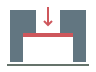

# Downward-facing hole support

Use when the person names `hole_support`, asks how to print a downward-facing
circular hole, or asks SAAM to add supports. Before placing conventional
[supports](../supports/SKILL.md), inspect for a larger bed-facing recess that
narrows abruptly into a concentric circular bore. Offer the strategies below
for each matching feature; leave unrelated support needs with `supports`.
Detection is advisory, and no treatment is chosen automatically.

Keep the interaction in chat by default. Show each small icon with its option
and let the person choose by name or number. Resolve local icon paths against
this package when embedding them in chat. Do not add persistent Studio buttons,
menus, panels or settings controls for this skill.

| Option | Icon | Result and finishing |
|---|---|---|
| Membrane |  | One solid bridge layer closes the bore at the counterbore shoulder. Subsequent layers print the ordinary bore. Drill through the membrane afterward. |
| Stepped reduction |  | First layer leaves a slot between two tangent bridging bands. Second layer bridges at 90 degrees, leaving a tangent square. Third bridges at 45 degrees, leaving an eight-sided opening. Fourth layer resumes the round bore. |
| Bore support |  | A hollow removable plug/sleeve rises from a one-layer bed flange to the shoulder, with 50% or 75% overlap against the first bore bead. Tear it away from below. |

These are construction strategies supplied by the person, with no physical
printing validation yet. Bridge span, material, cooling and removal access still
matter. Explain finishing before the choice: membrane needs a drill; sleeve needs
access from the counterbore; stepped reduction locally opens the transition
beyond the round bore. The shoulder must align with the deposited layer grid.
Use the [standard parameter policy](../../MAKERS.md#standard-parameter-policy).

## Inspect and apply

Start with an existing [print bundle](../../core/print/USAGE.md), in its intended
bed orientation. Local CLI:

```sh
node core/print/cli.mjs hole-support Prints/my-part
node core/print/cli.mjs hole-support Prints/my-part request.json --revision REV
```

MCP `inspect_hole_support({printId})` returns the current revision, feature IDs,
component IDs, centers/radii, any applied treatment and the three option/icon
records. `apply_hole_support({printId,expectedRevision,request})` applies a
selected strategy. Read this manual before using either tool. Copy the feature
dimensions from inspection rather than assuming the example dimensions.

```json
{
  "feature": {
    "id": "hole-1",
    "centerMm": [20, 20, 10],
    "boreRadiusMm": 5,
    "counterboreRadiusMm": 10,
    "strategy": "stepped-reduction"
  }
}
```

For an assembly add `part` with its component ID. `centerMm` is in component
coordinates at the shoulder, with Z measured from the bed. To edit, use the same
ID and only changed fields; omitted fields retain that feature's actual saved
values. Remove with `{"remove":"hole-1"}` and optional `part`. Rebuilding starts
from the saved original host, so changing strategies does not stack treatments.
The editable original geometry, treatment and compiled mesh live together in
`plan.json`; geometry changes invalidate the normal final confirmation.

| Field | Default and meaning |
|---|---|
| `strategy` | `membrane`; explicitly present the choice before application |
| `overlap` | `0.5`; or `0.75`, used by bore support only |
| `angleDeg` | `0`; first bridge direction, subsequent directions are +90 and +45 degrees |
| `bridgeSpeedMmS` | `20`; directed transition-pass speed |
| `centerMm`, `boreRadiusMm`, `counterboreRadiusMm` | Required; measured from the current host |

Transition thickness follows `process.layerMm`, rather than copying the
examples' 0.4 mm thickness. The sleeve inner radius is `boreRadiusMm - 1.5 *
holeLineWidthMm`; its outer radius is `boreRadiusMm + overlap * holeLineWidthMm`.
The first model bore bead covers radii `[r,r+w]`, so that overlap refers to its
actual footprint, not a percentage of the nominal hole diameter. The sleeve's
bed flange ends 1 mm or one bead width inside the counterbore, whichever is
larger. This follows the hollow sleeve and enlarged bed ring in the supplied
`Bore Support.step`; it is sacrificial material in the compiled host.

## Contextual Studio Choice

Only during an active support discussion, the agent may open the print's Studio
URL with `?hole-support=1` (or append `&hole-support=1` when it has query fields).
It opens a temporary chooser with the three icons, feature selection and
50%/75% sleeve contact. The parameter is consumed immediately. Closing the
chooser leaves the ordinary Studio interface, with no persistent entry point.
A choice applies to the exact inspected revision and open print, then refreshes
geometry. This chooses a treatment; it does not confirm a machine program.

Ordinary [Studio review](../../studio/README.md) and generation remain the same:
review the geometry, generate, and confirm the current settings and exact
toolpath together before export. A support request can be handled completely in
chat through the same inspect/apply tools without opening this chooser.

## Limits and Recovery

The current implementation handles closed meshes and supported spline hosts
through shared section queries and the shared Manifold solid kernel. It detects
closed, approximately circular concentric openings on the Z axis, an abrupt
planar shoulder, and a clear vertical recess down to the bed. It rejects tapered,
tilted, blocked, noncircular or off-bed candidates. STEP files are reference data;
there is no general STEP import tool. Use a validated STL/native host for real
parts. The supplied examples are inventoried by their analytic STEP entities,
and the demo reconstructs the control's measured block and bores.

Use whole-component full-fill or planar-infill with contiguous hole walls,
spacing factor 1, and no regional, draped-skin or vase assignments. Assembly
components must start at Z=0. Other local deposition features on the same host
are rejected; they are not silently overwritten. Treatment footprints must not
overlap. There must be more than two hole-bead widths between the two radii,
and at least four layers of unchanged narrow bore above the shoulder, plus a
continuous two-bead supporting rim around the recess. Very small sleeves
or inadequate flange clearance are rejected. These limits do not prohibit
other supported strategies elsewhere in the print.

If the shoulder is off the layer grid, revise the source shoulder or select a
compatible layer height before applying. The compiled result locks the layer,
first-layer and bead widths it used. After changing those settings, rebuild
`hole_support` for them in the same recipe update rather than reusing a membrane
of the old thickness: supply `process: {"layerMm":0.25,"firstLayerMm":0.25}` alongside the feature
edit. `process` accepts positive `layerMm`, `firstLayerMm` and `lineWidthMm`;
all saved treatments are rebuilt together. A stale revision requires fresh inspection.

Use top-level `holeLineWidthMm` alongside an edit to rebuild for a different
hole bead width; `null` restores the shared body width. This is the existing
`full-fill.holeLineWidthMm` setting, also inherited by sparse planar walls.
When rebuilding an assembly, process changes affect every component, so rebuild
other treated components in the same complete recipe update as well.

A geometry failure leaves the existing bundle unchanged and routes to
[mesh tools](../mesh-tools/SKILL.md); do not accept partial results.

Bridge passes reserve the complete local transition footprint from both sparse
and solid fill, and precede ordinary contours at their layer. They use shared
layer heights, bead volume, travel, composition and exporters. The stepped
apertures have at most 0.003 mm extra radial clearance to avoid coincident
tangent edges; boolean cutting planes overlap by 0.00001 mm to avoid internal
films. Output simplification bounds displacement to 0.00001 mm. Those are
construction tolerances, not printer hole compensation or fit guarantees.

## References and Demo

The user-selected [references](references/README.md) are preserved unchanged.
The stepped STEP has a slot from Z=0 to 0.4, square from 0.4 to 0.8 and eight-sided
transition from 0.8 to 1.2. Four orthogonal tangent sides plus four diagonal sides
make an octagon, rather than the hexagon mentioned in the request.

```sh
node skills/hole_support/scripts/demo.mjs Prints/development/hole-support
node skills/hole_support/scripts/demo.mjs Prints/development/hole-membrane membrane
node skills/hole_support/scripts/demo.mjs Prints/development/hole-stepped stepped-reduction
node skills/hole_support/scripts/demo.mjs Prints/development/hole-plug bore-support
```

Each destination must be new. The control opens the choices without treatment;
the named strategies generate unapproved development exports on the S5 profile.
The 40 x 40 x 20 mm host has a 20 mm counterbore 10 mm deep below a 10 mm bore.
No command grants manufacturing approval or sends a job to hardware.
